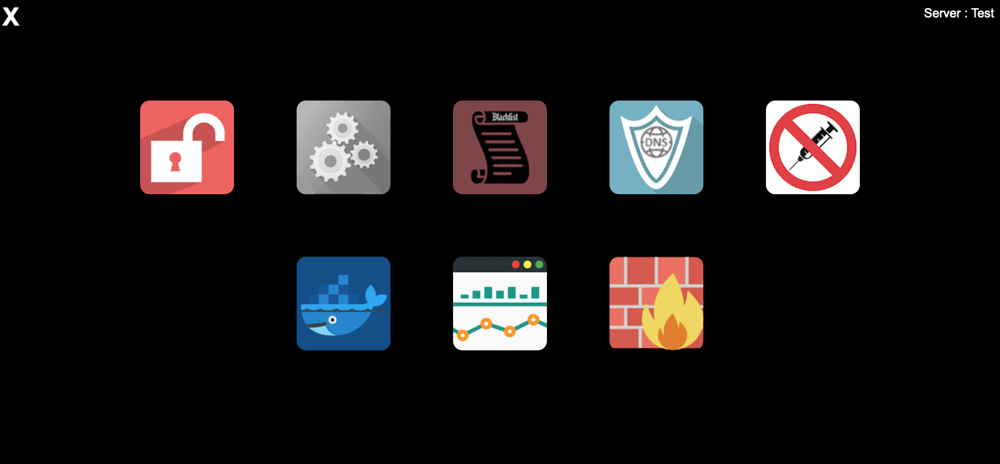
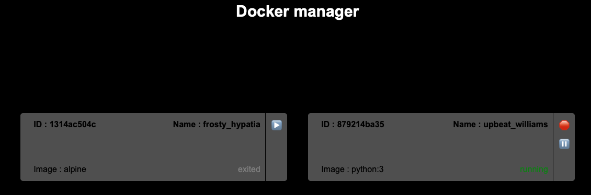
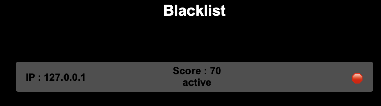
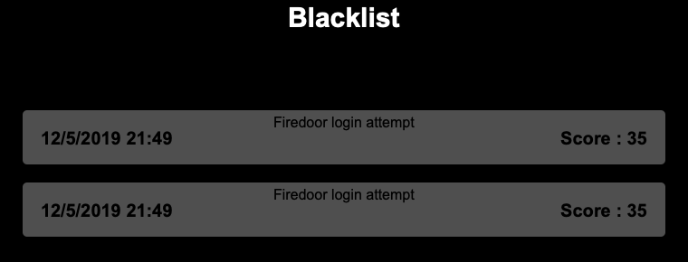
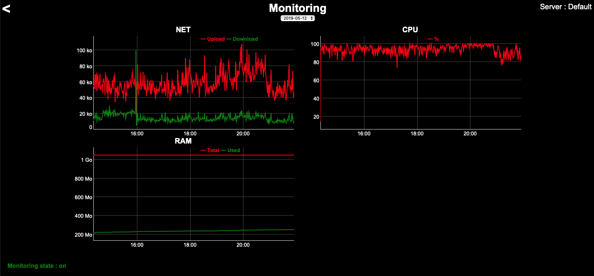

# Firedoor

Léo -> [http://hello-leo.tk](http://hello-leo.tk)

Le but de ce projet est de concevoir un gestionnaire de serveur : 

* standalone
* simple
* modulaire

## Introduction

Lors de la mise en service d'un serveur, après l'installation de l'OS, nous obtenons une machine vierge, disponsant la plupart du temps d'un unique acces SSH pour l'administrer.

L'objectif de Firedoor, et d'intervenir à ce moment là, pour securiser cet unique accès, et vous accompagner dans la gestion et securisation de votre serveur.

C'est en quelque sorte la brique elementaire que l'on place en 1er, avant de positionner les services derriere

## Standalone ?

Firedoor est entirerement developpé en Python, puis packadgé par PyInstall pour obtenir un binaire sans dependance.

## Simple ?

Firedoor s'installe en une commande, après cela, toutes les actions d'administration se font depuis l'interface web via des menus intuitifs.

*Pour ceux qui n'ont pas besoins de boutons, il est possible d'effectuer l'administration directement en ligne de commande, avec les mêmes fonctionnalités*

## Modulaire ?

Firedoor est un peu comme une passerelle qui fait le lien entre les differents services de votre machine au travers des differents modules.
Dans Firedoor, **TOUT EST MODULE**, y compris ses fonctionnalitées principales (*core modules*).

Une template de module à été établie, qui definie les variables et methodes auquelles les modules on accès, ainsi que leurs entrypoints

On peut ajouter n'importe quelle fonctionnalité imaginable et l'ajouter, sans jamais toucher au code principal de Firedoor.

Chaque module et un dossier, qu'il suffi de glisser dans le dossier modules avant de generer le binaire.


Voici quelques exemples du fonctionnement modulaire de Firedoor :

### Installation

Lors de son installation Firedoor va inventorier ses modules afin de voir si ils disposent d'un entrypoint d'installation.
Si c'est le cas, les pré-requis de chacun vont êtres validés pour garantir le bon fonctionnement de chaque modules

### Interfaces web

Lors de l'accès à l'interface web, Firedoor liste les modules disposants d'une interface web, afin de les integrer graphiquement.

### CLI

De la même maniere lors de la saisi d'un commande, les arguments sont directement envoyé dans l'entrypoint CLI du module concerné (si il en dispose)

## Liste des modules

| Nom           | Status    | Type               |  Fontion                      |
| :------------ | :-------- | :----------------- | :---------------------------- |
| Settings      | Pret      | Core module        | Permet de modifier les parametres basiques (MDP, Hostname, port, TLS...) ainsi qu'activer et desactiver les autres modules |
| Locked        | Pret      | Core module | Cache les ports d'administration (SSH, FTP...) quand ils ne sont pas utiles. Cela permet de prevenir les scans et les indexations comme Shodan ou ZoomEye |
| The blacklist | Pret      | Core module        | Enregistre les raport des modules de detection, evalue le danger de chaque IP puis la bloque si necessaire |
| Rules manager | Pret      | Module additionnel | Permet de gerer simplement les regles du firewall pour rendre accessible les services legitimes |
| Monitoring    | Pret      | Module additionnel | Assure la surveillance l'enregistrement et la consultation des constantes vitales de votre serveur |
| WAF           | Pret (basique) | Module additionnel | Analyse du trafic entrant, detection SQLI/XSS |
| DNS Shield    | Pret (basique) | Module additionnel | Analyse du trafic entrant, detection des DDoS par reflexion/amplification |
| Docker        | Pret      | Module additionnel | Permet la visualisation et l'administration de ses conteneurs Docker |
| SSHTTP        | En cours  | Module additionnel | Client ligne de commande web pour administrer votre serveur depuis n'importe quel poste sans rien installer |
| Updater       | A faire   | Module additionnel | Verifie les MAJ à effectuer et permet de definire une politique de MAJ automatique |
| Bake-up       | A faire   | Module additionnel | [Sauvegarde incrementielle par Hard-linking](https://github.com/H4ckd4ddy/Bake-up) |


# Installtion

Python 3.7 requis

### Execution directe du code source

```
cd src/
pip3 install -r requirements.txt  # Installation des dépendances
./firedoor.py install  # Installation de Firedoor
./firedoor.py  # Lancement de Firedoor
```

###### ou

### Construction et installation du binaire

```
pip3 install -r src/requirements.txt  # Installation des dépendances
pip3 install pyinstaller
./build.sh  # Creation du binaire
chmod +x dist/firedoor
cp dist/firedoor /usr/sbin/firedoor
/usr/sbin/firedoor install
systemctl start firedoor
```

# Utilisation

Une fois Firedoor lancé, un serveur web se lance par defaut sur le port 80

(Si vous devez modifier la configuration avant de lancer Firedoor, editez directement /etc/firedoor/database.json)

Le mot de passe par defaut est ```firedoor```

Vous pouvez alors gerer Firedoor directement via l'interface web, avec les differents modules

(Pour activer les autres modules, utilisez le modules settings)


# A faire

* Commentaires
* PEP8
* Homogenisation du code des modules
* Interface utilisant un API REST


à ajouter :

| Module        |  Fontion à ajouter                                           |
| :------------ | :----------------------------------------------------------- |
| Settings      | Activation de l'authentification par OTP                     |
| The blacklist | Ajout d'une interface de reglages (durée de ban, scoring...) |
| Rules manager | Ajouter un tableau de gestion des regles de management       |
| Monitoring    | Ajout d'une sonde pour le disque                             |
| WAF           | Ajout d'une interface de gestion des analyzers               |
| Docker        | Ajout de la visualisation des ports et des logs              |
| SSHTTP        | Le faire fonctionner                                         |
| Updater       | Le faire                                                     |
| Bake-up       | Le faire                                                     |


# Screenshots






